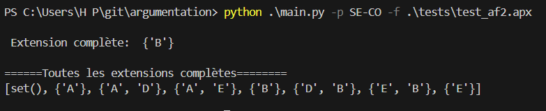
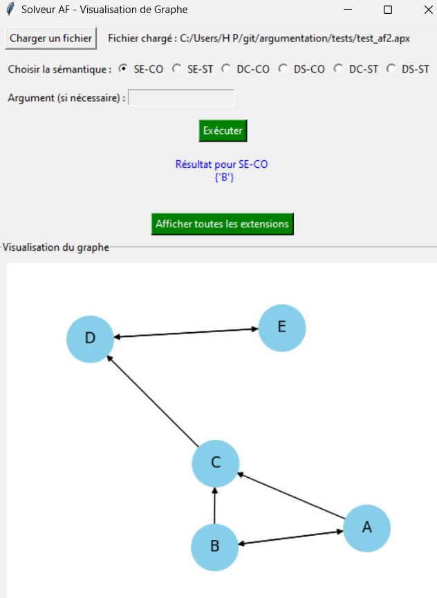
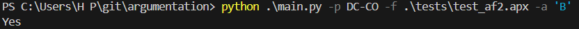
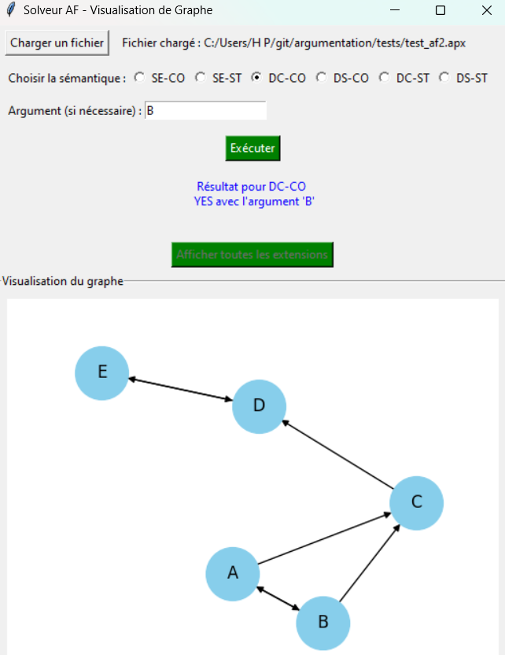
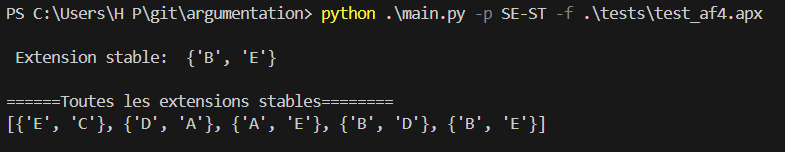
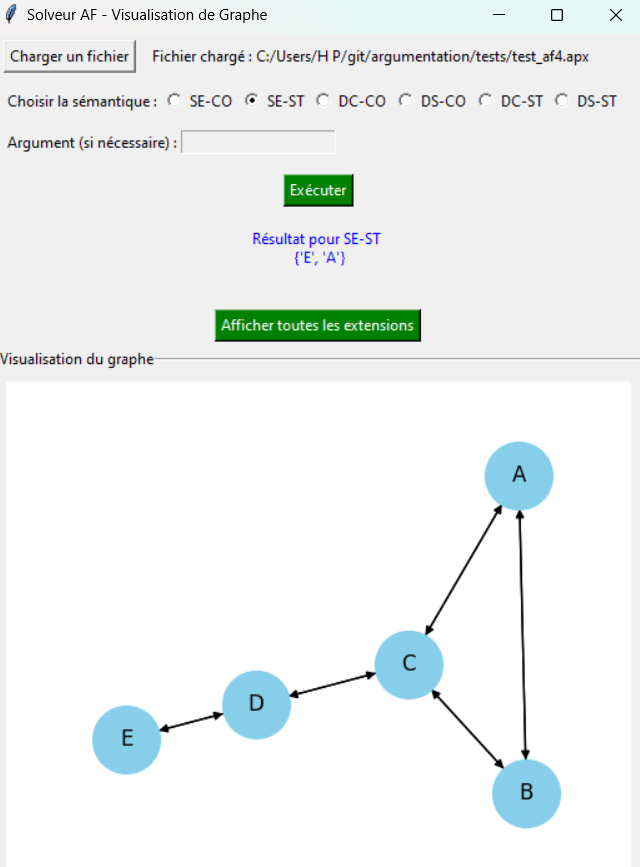

# 🔍 Solveur d'Argumentation - Extensions Complètes et Stables

## 📌 Introduction
Ce projet implémente un **solveur d'argumentation** permettant de calculer les extensions complètes et stables d’un **framework d'argumentation abstrait (AF)**. L’outil peut également déterminer si un argument appartient à une ou plusieurs extensions.

## 🎯 Fonctionnalités
- **SE-CO** : Calcul d'une extension complète.
- **DC-CO** : Vérification si un argument appartient à une extension complète.
- **DS-CO** : Vérification si un argument appartient à toutes les extensions complètes.
- **SE-ST** : Calcul d'une extension stable.
- **DC-ST** : Vérification si un argument appartient à une extension stable.
- **DS-ST** : Vérification si un argument appartient à toutes les extensions stables.

## ⚙️ Installation et Exécution
### 📥 Prérequis
- Python 3.x 

### 🚀 Exécution
```bash
python program.py -p SE-CO -f af.txt
```

### 🖥️ Interface Graphique
L’outil intègre également une interface graphique réalisée avec **Tkinter**. Pour lancer l’interface :
```bash
python af_visualizer.py

## 📄 Format du fichier d'entrée
Le fichier texte contenant l'AF suit ce format :
```txt
arg(a).
arg(b).
arg(c).
arg(d).
att(a,b).
att(b,c).
att(b,d).
```

## 📊 Exemples de commandes et résultats attendus
**Exemple 1 : Calcul d'une extension complète**
```bash
python program.py -p SE-CO -f af.txt
```
**Sortie :**
```
[a, c, d]
```

**Exemple 2 : Vérification de l’appartenance d’un argument**
```bash
python program.py -p DC-CO -f af.txt -a a
```
**Sortie :**
```
YES
```

## 📸 Captures d'écran
Quelques captures d'écran :
<table>
  <tr>
    <td></td>
    <td></td>
  </tr>
  <tr>
    <td></td>
    <td></td>
  </tr>
  <tr>
    <td></td>
    <td></td>
  </tr>
</table>

## 🏗️ Algorithmes utilisés
Le solveur utilise des algorithmes basés sur :
- **Représentation des connaissances et raisonnement**
- **Théorie des ensembles admissibles et stables**
- **Propagation des labels IN, OUT et MUST OUT** pour générer les extensions

## 🚀 Améliorations possibles
- Support d’autres sémantiques d’argumentation
- Interface graphique améliorée avec des fonctionnalités avancées


## 📚 Références
Ce travail s'appuie sur les recherches suivantes :
- Pietro Baroni, Martin Caminada, et Massimiliano Giacomin. *An introduction to argumentation semantics.* Knowledge Eng. Review, 26 :365-410, 12 2011.
- Samer Nofal, Katie Atkinson, et Paul E. Dunne. *Algorithms for argumentation semantics: Labeling attacks as a generalization of labeling arguments.* J. Artif. Intell. Res., 49 :635-668, 2014.

## 💡 Remerciements
Un grand merci à **CONVERT Hugo** pour sa contribution précieuse à la réalisation de ce projet. 🙌

## 📢 Contact
N’hésitez pas à donner vos retours ou à contribuer au projet ! 😊


---
🌍 **[LinkedIn] : (https://www.linkedin.com/in/ulricho-5185bf-world/)** | 📂 **[GitHub] : (https://github.com/kiswayODG/arg_sys)**
